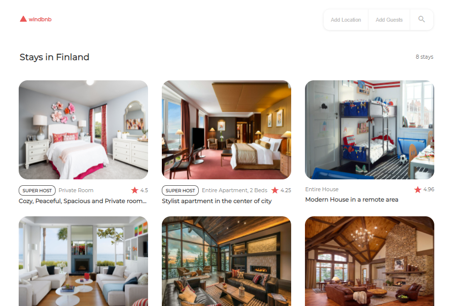
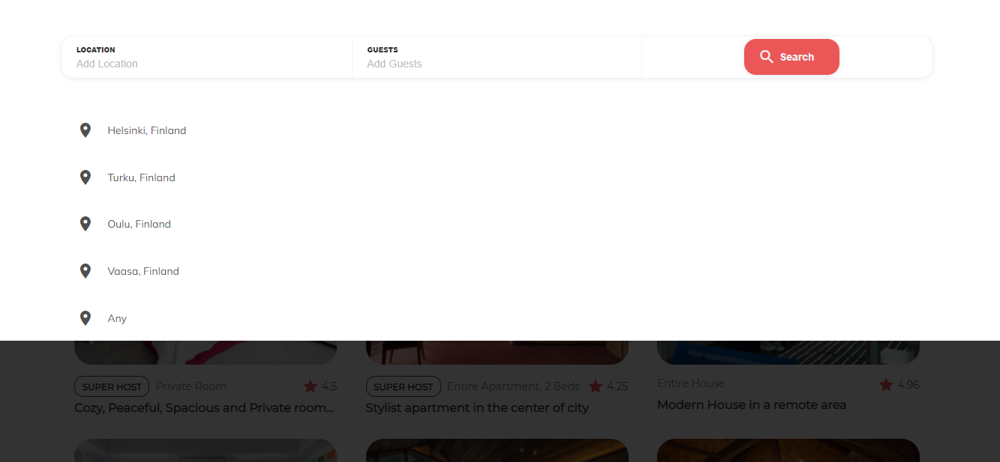
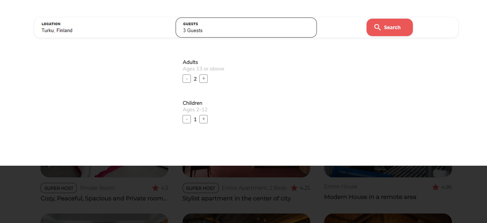
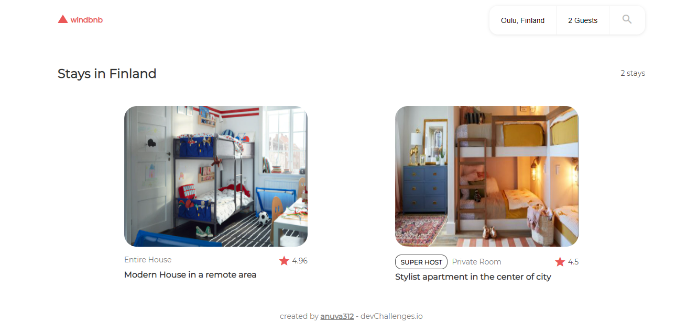
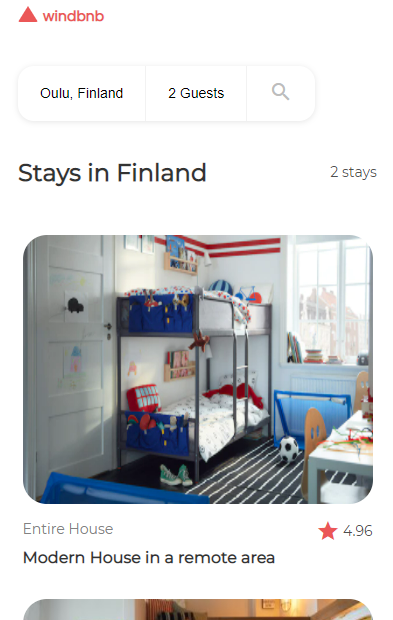

# Windbnb

Solution for the [WindBnB Challenge](https://devchallenges.io/challenges/3JFYedSOZqAxYuOCNmYD) from [Devchallenges.io](https://devchallenges.io).

<!-- TABLE OF CONTENTS -->

## Table of Contents

- [Challenge](#challenge)
- [Solution](#solution)
  - [Demo](#demo)
  - [Demo Screenshots](#demo-screenshots)
  - [Built With](#built-with)
- [How to Use](#how-to-use)
- [Acknowledgements](#acknowledgements)

<!-- Challenge -->

## Challenge

Challenge: Create a small version of Airbnb - Windbnb with given data.
Use Front-end libraries like React or Vue.

Fulfill user stories below:

- User story: I can see a list of properties
- User story: I can see the property card with a name, rating, apartment type, and super host
- User story: I can open the filter drawer
- User story: I can filter properties by location and number of guests
- User story: I can see the number of filtered items
- User story: I can see pages following given designs

## Solution

### Demo

Find the website in action [here](https://silly-goodall-4678a9.netlify.app/)!

### Demo Screenshots

Home Page



Filter By Location



Filter By No.of Guests



Filter-Results



Mobile View



### Built With

<!-- This section should list any major frameworks that you built your project using. Here are a few examples.-->

- [React](https://reactjs.org/)

## How To Use

<!-- For example: -->

To clone and run this application, you'll need [Git](https://git-scm.com) and [yarn](https://yarnpkg.com/). From your command line:

```bash
# Clone this repository
$ git clone https://github.com/anuva312/WindBnB-devChallenges

# Install dependencies
$ yarn install

# Run the app
$ yarn start
```

## Acknowledgements

- The pictures used in the Demo have been downloaded through Google Search, I do not own any of them.
